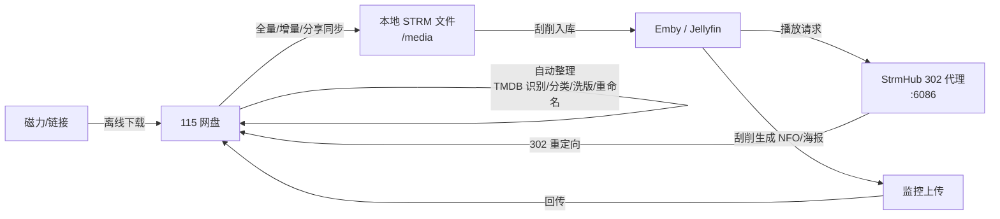

# StrmHub

115 网盘 → 本地 STRM → Emby 直接播放的一站式自动化工具。

StrmHub 把 115 网盘的媒体库映射为本地 STRM 文件供 Emby/Jellyfin 刮削入库，播放时通过 302 直链代理让播放器直连 115（不经过服务器转发、不消耗服务器带宽），并在一个界面里完成**同步、整理、洗版、重命名、元数据回传、消息机器人**的全部闭环。



## 功能特性

### 同步
- **全量同步**：115 目录树 → 本地 STRM；字幕 / NFO / 图片等附属文件按需下载
- **增量同步**：基于 115 生活事件，零遍历、只处理新增变更，支持 Cron 定时
- **分享同步**：转存 115 分享链接到指定目录后自动进入整理流程
- **转存下载**：115 分享链接一键转存（自动带提取码）；磁力 / ed2k 提交 115 离线任务；完成后自动整理入库

### 影视转存（资源站）
- **影巢（HDHive）OAuth 授权登录**：一键跳转影巢授权页，授权后自动返回并显示账号信息；官方内置镜像开箱即用，自部署也可填自有应用凭据（应用 Secret 走 X-API-Key，用户令牌自动续期）
- **内置应用分发**：凭据经 GitHub Actions Secrets 构建时注入镜像（不进源码仓库），静态中转页统一承接各部署的授权回调（`deploy/oauth-relay.html`）
- **观影（GuanYing）种子资源**：TMDB 先选具体影片 → 站内账号密码登录（服务端自动通过 RSW 反爬验证，Cookie 持久化、失效自动重登）→ 搜索站内种子 → 磁力一键提交 115 离线下载，完成后自动整理入库；站点域名可配置（常换域名）
- **可扩展 Tab**：影视转存页预留更多资源站入口，后续接入其他 API

### 整理（整理到 115 网盘内）
- **TMDB 识别**：按文件名识别影视信息，支持 GPT 辅助识别疑难命名
- **二级分类**：YAML 规则把媒体归入 电影 / 剧集 / 国别 / 类型 等层级（可自定义）
- **重命名模板**：变量化命名（标题、年份、分辨率、编码、特效等）
- **洗版**：五种模式（`coexist` 共存 / `skip` 跳过 / `replace` 替换 / `max_size` 留最大 / `min_size` 留最小）+ 按画质条件圈定作用范围，YAML 配置
- **SHA1 查重**：转存整理前比对已入库文件指纹，重复内容直接跳过
- **广告清理**：自动识别并批量移动宣传文件，AV 文件名清洗（去域名/水印前缀）
- **批量重命名**：整理前先在 115 端批量改名，避免逐个请求触发风控

### 媒体信息补全
- 内置 ffmpeg/ffprobe，对命名不规范的文件做**头部分析**（只读文件头，不下载全文件）
- 提取真实分辨率 / 视频编码 / 音轨 / HDR / DV / 时长，按策略改写文件名
- 八种情形独立策略（缺失 / 命中 / 冲突高保护 / 冲突低保护 / 探测失败 / 完整命名等），每项可选「按探测结果改名」或「保留原名」，默认关闭、用户手动开启

### 播放与 Emby
- **302 直链代理**（端口 6086）：STRM 内只存短链，播放时按客户端 Host 动态重写、定向到 115 直链，Emby 端强制 DirectPlay 不转码
- **空白 UA 兼容**：部分播放器（手机端等）不带 UA，自动切换服务器中转流取链
- **元数据回传闭环**：Emby 刮削生成的 NFO / 海报 / 剧集图片保存到媒体目录后，监控上传自动回传 115 对应目录
- **一键建库插件**：扫描本地媒体二层目录（如 `/media/电影/国产剧`），库名=目录名，自动配置中文元数据、NFO/图片本地保存、媒体路径（含路径映射）

### 消息与机器人
- **企业微信双向机器人**：直接发链接即触发——磁力/ed2k 提交离线下载、115 分享（连同提取码）自动转存整理；另支持 `状态` / `搜索` / `整理` / `同步` / `补全` / `帮助` 指令，AES 加密验签
- **Emby Webhook 通知**：Emby 入库/删除/播放事件经 StrmHub 转发到企微/TG（自动生成鉴权 token 的接收地址，剧集自动拼剧集名与季数）
- **Telegram 通知**：任务完成推送

### 安全与稳定
- 115 API 全局限流（读 1s / 写 3s 分级，防风控），UI 可调
- 日志轮转（10MB × 3 份），实时日志页按任务过滤
- JWT 登录 + 登录防爆破（同 IP 连续 5 次失败锁定 10 分钟）；管理员账号由环境变量 `AUTH_USER` / `AUTH_PASSWORD` 提供
- 115 OpenAPI（PKCE OAuth 授权 + Token 自动刷新）与 Cookie 双通道互备

## 快速部署

```bash
mkdir strmhub && cd strmhub
# 保存以下内容为 docker-compose.yml
docker compose up -d
```

```yaml
services:
  strmhub:
    image: ghcr.io/daisyyijin/strmhub:latest
    container_name: strmhub
    restart: unless-stopped
    ports:
      - "6060:6060"   # 管理后台
      - "6086:6086"   # 302 直链代理
      - "6688:6688"   # 观影门户
    volumes:
      - ./config:/config
      - ./data:/data
      - ./media:/media
      - ./logs:/logs
    environment:
      - TZ=Asia/Shanghai
      - AUTH_USER=admin          # 管理后台账号（环境变量管理，无网页注册）
      - AUTH_PASSWORD=change-me  # ★ 改成强密码；修改后 docker compose up -d 生效
```

多架构镜像（amd64 / arm64）由 GitHub Actions 自动构建，每次推送 main 分支自动更新 `latest`。

## 端口与目录

| 端口 | 用途 |
|---|---|
| 6060 | 管理后台（网页） |
| 6086 | 302 直链代理（Emby 播放走这里） |
| 6688 | 观影门户（海报墙 + 网页播放） |

| 容器目录 | 用途 |
|---|---|
| `/config` | 账号凭据、系统配置 |
| `/data` | 数据库（同步台账、整理记录、SHA1 查重表） |
| `/media` | 本地 STRM 与附属文件（Emby 挂载同一个目录） |
| `/logs` | 运行日志 |

## 环境变量

| 变量 | 默认 | 说明 |
|---|---|---|
| `AUTH_USER` | — | **管理员用户名**（推荐在 compose 中显式配置） |
| `AUTH_PASSWORD` | — | **管理员密码**；修改后 `docker compose up -d` 重启生效 |
| `PORT` | 6060 | 管理后台端口 |
| `PROXY_PORT` | 6086 | 302 代理端口 |
| `DATA_DIR` | /data | 数据目录 |
| `CONFIG_DIR` | /config | 配置目录 |
| `JWT_SECRET` | 自动生成 | 登录令牌密钥；未设置时首启自动生成随机密钥存于 `/config/jwt.key`，重启不失效 |
| `STRMHUB_115_INTERVAL` | 1000 | 115 读接口最小间隔（毫秒），数据库设置优先 |

> **管理员账号说明**：网页注册已移除。账号以环境变量 `AUTH_USER` / `AUTH_PASSWORD` 为准，每次启动自动同步；两者都未配置且无历史账号时，首次启动会自动生成随机密码并打印在容器日志（`docker logs strmhub`）。改环境变量即改密码，重启生效。

## 基本使用流程

1. 浏览器打开 `http://IP:6060`，用 compose 里配置的 `AUTH_USER` / `AUTH_PASSWORD` 登录
2. **账号管理**：扫码或 OpenAPI 授权登录 115
3. **账号同步**：配置网盘根目录与本地 `/media`，执行全量同步
4. Emby 添加媒体库指向 `/media`（可用插件中心「一键创建 Emby 媒体库」），播放确认 DirectPlay
5. **自动整理**：配置 TMDB / 分类 / 洗版 / 重命名规则，跑一次整理验证效果

详细说明见 **[USAGE.md 使用文档](USAGE.md)**。

## 路线图

- [x] 115 全量 / 增量 / 分享同步、离线下载
- [x] TMDB 整理 / 二级分类 / 洗版 / 重命名 / SHA1 查重
- [x] 媒体信息补全（ffprobe）
- [x] Emby 元数据回传 115（监控上传）
- [x] 企业微信双向机器人
- [x] 插件中心（一键建库）
- [ ] ALIST 同步
- [ ] 115 文件夹清空插件
- [ ] AI 字幕生成（Whisper，规划中）

## 注意事项

- 115 对高频请求有风控，**不要把 API 间隔调低于默认值**；写入类操作保持 ≥3s
- 公网部署请配置强 `AUTH_PASSWORD` 并使用 HTTPS 反代；`JWT_SECRET` 不设置会自动生成并持久化，无需手工管理
- STRM 目录（`/media`）需要 Emby 同时挂载，路径不一致时在 EMBY 配置里设置路径映射（`本地路径#Emby路径`）
