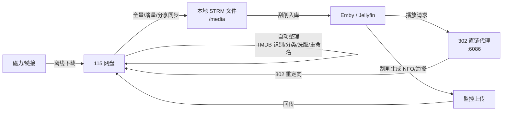

# 115-Station

> **本项目基于 [DaisyYijin/STRMhub](https://github.com/DaisyYijin/STRMhub) 二次开发。**
> 上游项目为原始作者所有，本仓库在其基础上做了裁剪与改动（详见[与上游的差异](#与上游的差异)）。

115 网盘 → 本地 STRM → Emby/Jellyfin 直接播放的一站式自动化工具。

把 115 网盘的媒体库映射为本地 STRM 文件供 Emby/Jellyfin 刮削入库，播放时通过 302 直链代理让播放器直连 115（不经过服务器转发、不消耗服务器带宽），并在一个界面里完成**同步、整理、洗版、重命名、元数据回传、消息机器人**的全部闭环。



---

## 交流群

使用问题、Bug 反馈、版本更新，都在群里聊：

**[Telegram 交流群 →](https://t.me/+7b_HYMltYMozZTk1)**

---

## 项目来源与致谢

| 项目 | 地址 | 说明 |
|---|---|---|
| 上游（Upstream） | <https://github.com/DaisyYijin/STRMhub> | 原始项目，核心架构与绝大部分代码由其作者编写 |
| 本仓库 | 本项目 | 在上游基础上裁剪网盘支持范围，仅保留 115 链路 |

本项目的所有核心能力——STRM 同步引擎、302 直链代理、TMDB 整理流水线、洗版策略、
ffprobe 媒体信息补全、Emby 元数据回传、消息机器人——均来自上游 STRMhub。
在此向原作者 [@DaisyYijin](https://github.com/DaisyYijin) 表示感谢。

如果这个工具对你有用，**请优先去上游仓库点 Star**。

> **关于提交历史**：本仓库是独立新建的，不是 GitHub 意义上的 fork，**没有保留上游的
> commit 历史**——第一个提交就包含了上游的全部代码。这意味着 `git blame` / `git log`
> 会把上游作者写的代码归到本仓库维护者名下，这是仓库形态导致的，不是署名主张。
> 代码作者身份以本节与上游仓库为准。

---

## 与上游的差异

本仓库相对上游 STRMhub 的改动：

- **移除 123 云盘相关功能**
- **移除夸克网盘相关功能**
- **移除阿里云盘（阿里网盘）相关功能**

对应影响：

| 位置 | 变化 |
|---|---|
| 聚合搜索（PanSou） | 搜索结果中来自 123 / 夸克 / 阿里的链接被过滤（见 [`internal/api/pansou.go`](internal/api/pansou.go) 的 `removedCloudResource`，按 `cloud_type` 标签与链接域名双重判定，规避错误标签） |
| 转存 / 离线 | 只接受 115 分享链接与磁力 / ed2k，其余网盘分享不再处理 |
| 前端 | 相关入口与配置项已移除 |

> **注意**：[`internal/api/upload115.go`](internal/api/upload115.go) 中出现的「阿里云 OSS」是 115 官方上传接口所使用的对象存储协议，
> 与阿里云盘无关，属于 115 上传链路的必要组成部分，未移除。

其余功能与上游保持一致。上游仍在持续更新，本仓库不保证与其同步。

---

## 许可证与再分发声明

**请在使用、分发本仓库前阅读本节。**

截至本文撰写时，上游仓库 [DaisyYijin/STRMhub](https://github.com/DaisyYijin/STRMhub)
**未附带任何开源许可证文件（LICENSE）**。

根据 GitHub 服务条款与著作权法的通行规则：

- 公开在 GitHub 上的代码，若**没有**声明许可证，默认为**保留所有权利（All Rights Reserved）**；
- GitHub ToS 仅允许其他用户**查看仓库**，以及**在 GitHub 平台内 fork** 该仓库；
- 在未获得原作者授权的情况下，**不自动获得**在 GitHub 之外修改、再分发、商用该代码的权利。

因此本仓库**刻意不附带 LICENSE 文件**，也不对本项目代码作出任何开源授权声明——
在上游未授权的前提下，下游 fork 无权替上游决定许可条款。

**建议做法：**

1. 向上游作者提 issue，请其补充一个明确的开源许可证（如 MIT / Apache-2.0 / AGPL-3.0）；
2. 上游一旦补充许可证，本仓库将同步遵循该许可证，并在此处更新说明。

本仓库通过 GitHub Actions 发布容器镜像到 ghcr.io 以便自部署使用。
镜像内含上游代码，因此**同样适用上述「未声明许可证」的状况**——
使用者请自行判断是否接受，本仓库不对镜像作出任何授权声明。

如果你是上游作者并希望本仓库做出调整（补充署名、变更措辞或下架），请提 issue，我会配合处理。

### 第三方组件

本项目（含上游代码）依赖以下第三方组件。**它们的许可证义务独立于上游的授权状况**——
本仓库不给自己的代码发许可证，但这些组件要求的版权声明与许可证副本必须随附，
全文见 [`licenses/`](licenses/)，逐项说明见 **[THIRD-PARTY-NOTICES.md](THIRD-PARTY-NOTICES.md)**。

| 组件 | 用途 | 许可证 |
|---|---|---|
| Go 依赖（见 [`go.mod`](go.mod)） | Gin、GORM、115driver、jwt 等 | 各依赖自有许可证 |
| [CodeMirror 5](https://codemirror.net/5/)（旧前端曾使用，现已移除） | YAML 配置编辑器 | MIT |
| 思源黑体 Source Han Sans（`internal/api/assets/`） | 媒体库封面生成字体 | SIL OFL 1.1 |
| FFmpeg（运行镜像内） | 媒体信息探测 | LGPL / GPL（Alpine 包） |

---

## 快速部署

镜像发布在 GitHub Container Registry，支持 `linux/amd64` 与 `linux/arm64`：

```
ghcr.io/pancras-loe/115-station:latest
```

新建一个目录，写入下面的 `docker-compose.yml`（仓库根目录已附带一份可直接使用）：

```yaml
services:
  station:
    image: ghcr.io/pancras-loe/115-station:latest
    container_name: 115-station
    restart: unless-stopped
    stop_grace_period: 20s    # 优雅退出窗口：SIGTERM 后程序需要 ~3 秒收尾
    ports:
      - "6060:6060"   # 管理后台
      - "6086:6086"   # 302 直链代理
    volumes:
      - ./config:/config
      - ./data:/data
      - ./media:/media
      - ./logs:/logs
    environment:
      - TZ=Asia/Shanghai
      - AUTH_USER=admin          # 管理后台账号（环境变量管理，无网页注册）
      - AUTH_PASSWORD=change-me  # ★ 改成强密码；修改后 docker compose up -d 生效
```

```bash
docker compose up -d
```

浏览器打开 `http://<服务器IP>:6060` 登录。

### 镜像 tag

| tag | 含义 |
|---|---|
| `latest` | master 最新一次构建，滚动更新 |
| `1.2.3` / `1.2` | 语义化版本，打 `v*` git tag 时产出，适合要稳定性的部署 |
| `master` | 同 `latest` |

### 自行构建（可选）

不想用预构建镜像时：

```bash
git clone https://github.com/pancras-loe/115-station.git && cd 115-station
```

```bash
docker compose up -d --build
```

compose 里把 `image:` 换成 `build: .` 即可。

---

## 功能特性

### 同步
- **全量同步**：115 目录树 → 本地 STRM；字幕 / NFO / 图片等附属文件按需下载
- **增量同步**：基于 115 生活事件，零遍历、只处理新增变更，支持 Cron 定时
- **分享同步**：转存 115 分享链接到指定目录后自动进入整理流程
- **转存下载**：115 分享链接一键转存（自动带提取码）；磁力 / ed2k 提交 115 离线任务；完成后自动整理入库
- **失效 STRM 检测**：标出「本地还在、网盘源文件已删」的条目，确认后清理本地残留（只标记不自动删）
- **深度删除**：默认关闭；保留 Emby 原生删除事件与神医助手 `deep.delete` 联动，仅接受电影 / 单集 / 季 / 剧集，拒绝普通目录与媒体库容器事件。执行前核验 Emby 当前媒体库边界、挂载与本地缺失，再删除事件命中的网盘源文件（进 115 回收站），并沿父目录清理空目录。需配置有效的 Emby 地址与 API 密钥，核验失败则拦截。不定时扫描；整理记录的深度删除入口保留。

### 影视转存（资源站）
四个可切换的资源站页签，均以「搜索 → 转存/离线到 115 → 自动整理入库」为闭环：

- **观影（GuanYing）**：TMDB 先选具体影片 → 站内账号密码登录（服务端自动通过反爬验证，Cookie 持久化、失效自动重登）→ 搜索站内种子 → 磁力一键提交 115 离线下载。站点域名可配置（常换域名）
- **PanSou 聚合搜索**：对接开源项目 [fish2018/pansou](https://github.com/fish2018/pansou)，聚合 TG 频道与爬虫插件结果（**已过滤 123 / 夸克 / 阿里链接**）
- **木咖（Mukaku）**：不太灵系影视管理系统接入，镜像域名可配置
- **RE0**：影视资料与分享社区 OpenAPI 接入，支持 OAuth 授权与资源解锁

### 整理（整理到 115 网盘内）
- **TMDB 识别**：按文件名识别影视信息，支持 AI 增强识别（OpenAI 协议）兜底疑难命名
- **二级分类**：YAML 规则把媒体归入 电影 / 剧集 / 国别 / 类型 等层级（可自定义）
- **重命名模板**：变量化命名（标题、年份、分辨率、编码、特效等）
- **洗版**：五种模式（`coexist` 共存 / `skip` 跳过 / `replace` 替换 / `max_size` 留最大 / `min_size` 留最小）+ 按画质条件圈定作用范围，YAML 配置
- **SHA1 查重**：转存整理前比对已入库文件指纹，重复内容直接跳过
- **广告清理**：自动识别并批量移动宣传文件，文件名清洗（去域名 / 水印前缀）
- **批量重命名**：整理前先在 115 端批量改名，避免逐个请求触发风控

### 媒体信息补全
- 内置 ffmpeg/ffprobe，对命名不规范的文件做**头部分析**（只读文件头，不下载全文件）
- 提取真实分辨率 / 视频编码 / 音轨 / HDR / DV / 时长，按策略改写文件名
- 八种情形独立策略（缺失 / 命中 / 冲突高保护 / 冲突低保护 / 探测失败 / 完整命名等），每项可选「按探测结果改名」或「保留原名」，默认关闭、用户手动开启

### 播放与 Emby
- **302 直链播放**（端口 6086）：STRM 内只存短链；拦截 Emby 实际播放请求，校验用户和媒体源后返回 115 CDN 地址，由播放器直接获取视频
- **UA 一致性**：包括空白 UA 在内，按实际播放请求取链并隔离缓存；取链失败或需要转码时明确报错，不自动中转视频
- **按需离线（边下边播）**：STRM 指向自建播放端点，播放时才触发离线拉取
- **Emby 反向代理**：6086 端口上的 `/emby` 路径转发到真实 Emby 服务器
- **元数据回传闭环**：Emby 刮削生成的 NFO / 海报 / 剧集图片保存到媒体目录后，监控上传自动回传 115 对应目录
- **一键建库插件**：扫描本地媒体二层目录（如 `/media/电影/国产剧`），库名 = 目录名，自动配置中文元数据、NFO/图片本地保存、媒体路径（含路径映射）
- **媒体库封面生成**：按二级分类聚合入库记录，合成带库名的 1280×720 封面并推送到 Emby

### 消息与机器人
- **企业微信双向机器人**：直接发链接即触发——磁力 / ed2k 提交离线下载、115 分享（连同提取码）自动转存整理；另支持 `状态` / `搜索` / `整理` / `同步` / `补全` / `帮助` 指令，AES 加密验签
- **Emby Webhook 通知**：Emby 入库 / 删除 / 播放事件经本服务转发到企微 / TG（自动生成鉴权 token 的接收地址，剧集自动拼剧集名与季数）
- **多通道推送**：Telegram、飞书、OneBot、QQ 官方机器人
- **TG 关键词订阅**：订阅关键词（可指定频道），调度器按间隔轮询频道公开预览，命中新资源推送通知

### 安全与稳定
- 115 API 全局限流（读 1s / 写 3s 分级，防风控），UI 可调
- 日志轮转（10MB × 3 份），实时日志页按任务过滤
- JWT 登录 + 登录防爆破（同 IP 连续 5 次失败锁定 10 分钟）；管理员账号由环境变量 `AUTH_USER` / `AUTH_PASSWORD` 提供
- 不信任任何反代头，`ClientIP` 取实际连接地址（防 XFF 伪造绕过防爆破）
- 可选 HTTPS（`TLS_ENABLE=1`）：自签证书自动生成持久化，同端口自动识别明文 / TLS 并 308 跳转
- 115 OpenAPI（PKCE OAuth 授权 + Token 自动刷新）与 Cookie 双通道互备

---

## 端口与目录

| 端口 | 用途 |
|---|---|
| 6060 | 管理后台（网页） |
| 6086 | 302 直链代理（Emby 播放走这里，含 `/emby` 反代） |

| 容器目录 | 用途 |
|---|---|
| `/config` | 账号凭据、系统配置、JWT 密钥、TLS 自签证书 |
| `/data` | 数据库（同步台账、整理记录、SHA1 查重表、媒体库封面） |
| `/media` | 本地 STRM 与附属文件（Emby 挂载同一个目录） |
| `/logs` | 运行日志（`app.log`，10MB 轮转保留 3 份） |

## 环境变量

| 变量 | 默认 | 说明 |
|---|---|---|
| `AUTH_USER` | — | **管理员用户名**（推荐在 compose 中显式配置） |
| `AUTH_PASSWORD` | — | **管理员密码**；修改后 `docker compose up -d` 重启生效 |
| `PORT` | 6060 | 管理后台端口 |
| `PROXY_PORT` | 6086 | 302 代理端口 |
| `DATA_DIR` | /data | 数据目录 |
| `CONFIG_DIR` | /config | 配置目录 |
| `JWT_SECRET` | 自动生成 | 登录令牌密钥；未设置时首启自动生成随机密钥存于 `/config/jwt.key`，重启不失效 |
| `TLS_ENABLE` | 关闭 | 置 `1` 启用 HTTPS（自签证书自动生成） |
| `STATION115_INTERVAL` | 1000 | 115 读接口最小间隔（毫秒），数据库设置优先 |
| `TZ` | — | 时区，建议 `Asia/Shanghai` |

> **管理员账号说明**：网页注册已移除。账号以环境变量 `AUTH_USER` / `AUTH_PASSWORD` 为准，每次启动自动同步；
> 两者都未配置且无历史账号时，首次启动会自动生成随机密码并打印在容器日志（`docker logs 115-station`）。
> 改环境变量即改密码，重启生效。容器内也可执行 `./115-station --reset-admin` 只删账号文件而保留其他配置。

> **关于更新**：本项目没有应用内自更新（那条链路要往容器里挂 Docker socket，
> 风险与收益不成正比，已整条移除）。更新方式是 `docker compose pull && docker compose up -d`，
> 配置与数据都在挂载卷里，不受影响。

## 基本使用流程

1. 浏览器打开 `http://IP:6060`，用 compose 里配置的 `AUTH_USER` / `AUTH_PASSWORD` 登录
2. **账号管理**：扫码或 OpenAPI 授权登录 115
3. **Strm 管理**：`STRM 配置` 填直链域名，`全量同步` 配置网盘根目录与本地 `/media` 后跑一次全量
4. Emby 添加媒体库指向 `/media`（可用插件中心「一键创建 Emby 媒体库」），客户端通过 6086 访问 Emby，确认播放请求返回 302 后直连 CDN
5. **自动整理**：配置 TMDB / 分类 / 洗版 / 重命名规则，跑一次整理验证效果

详细说明见 **[USAGE.md 使用文档](USAGE.md)**，或打开 [`wiki/index.html`](wiki/index.html) 查看完整版 Wiki。

---

## 本地开发

需要 Go 1.25+。

```bash
go build ./... && go vet ./... && go test ./... -count=1
```

不走容器直接跑时，需要准备 `/config`、`/data`、`/media`、`/logs` 四个目录，
或用 `CONFIG_DIR` / `DATA_DIR` 环境变量指到本地路径。

项目结构与开发约定见 **[AGENTS.md](AGENTS.md)**。

---

## 注意事项

- 115 对高频请求有风控，**不要把 API 间隔调低于默认值**；写入类操作保持 ≥3s
- 公网部署请配置强 `AUTH_PASSWORD` 并使用 HTTPS 反代；`JWT_SECRET` 不设置会自动生成并持久化，无需手工管理
- STRM 目录（`/media`）需要 Emby 同时挂载，路径不一致时在 EMBY 配置里设置路径映射（`本地路径#Emby路径`）
- 容器停止请给足优雅退出窗口（`stop_grace_period: 20s`），否则可能留下「115 已搬移、台账未写」的中间态

## 免责声明

本项目仅供个人学习与技术研究使用。使用者需自行承担因使用本项目产生的一切后果，
包括但不限于账号风控、数据丢失、服务中断。请遵守 115 网盘及各资源站的用户协议与当地法律法规，
不要用于任何侵犯他人著作权的用途。
