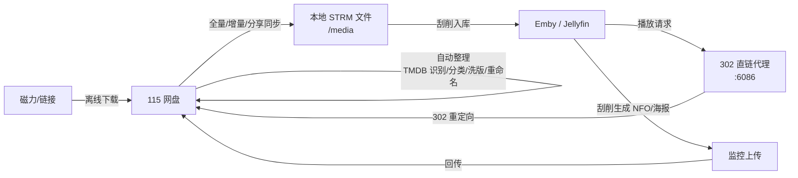

# 115-Station

115 网盘 → 本地 STRM → Emby/Jellyfin 直接播放的一站式自动化工具。

把 115 网盘的媒体库映射为本地 STRM 文件供 Emby/Jellyfin 刮削入库，播放时通过 302 直链代理让播放器直连 115（不经过服务器转发、不消耗服务器带宽），并在一个界面里完成**同步、整理、洗版、重命名、元数据回传、消息机器人**的全部闭环。


```mermaid
flowchart LR
    A[115 网盘] -- 全量/增量/分享同步 --> B[本地 STRM 文件<br>/media]
    B -- 刮削入库 --> C[Emby / Jellyfin]
    C -- 播放请求 --> D[302 直链代理<br>:6086]
    D -- 302 重定向 --> A
    C -- 刮削生成 NFO/海报 --> E[监控上传]
    E -- 回传 --> A
    F[磁力/链接] -- 离线下载 --> A
    A -- 自动整理<br>TMDB 识别/分类/洗版/重命名 --> A
```

---

## 交流群

使用问题、Bug 反馈、版本更新，都在群里聊：

**[Telegram 交流群 →](https://t.me/+7b_HYMltYMozZTk1)**

---

## 快速部署

镜像发布在 GitHub Container Registry，支持 `linux/amd64` 与 `linux/arm64`：

```
ghcr.io/pancras-loe/115-station:latest
```

新建一个目录，写入下面的 `docker-compose.yml`（仓库根目录已附带一份可直接使用）：

```yaml
services:
  station:
    image: ghcr.io/pancras-loe/115-station:latest
    container_name: 115-station
    restart: unless-stopped
    stop_grace_period: 20s    # 优雅退出窗口：SIGTERM 后程序需要 ~3 秒收尾
    ports:
      - "6060:6060"   # 管理后台
      - "6086:6086"   # 302 直链代理
    volumes:
      - ./config:/config
      - ./data:/data
      - ./media:/media
      - ./logs:/logs
    environment:
      - TZ=Asia/Shanghai
      - AUTH_USER=admin          # 管理后台账号（环境变量管理，无网页注册）
      - AUTH_PASSWORD=change-me  # ★ 改成强密码；修改后 docker compose up -d 生效
```

```bash
docker compose up -d
```

浏览器打开 `http://<服务器IP>:6060` 登录。

### 镜像 tag

| tag | 含义 |
|---|---|
| `latest` | master 最新一次构建，滚动更新 |
| `1.2.3` / `1.2` | 语义化版本，打 `v*` git tag 时产出，适合要稳定性的部署 |
| `master` | 同 `latest` |

### 自行构建（可选）

不想用预构建镜像时：

```bash
git clone https://github.com/pancras-loe/115-station.git && cd 115-station
```

```bash
docker compose up -d --build
```

compose 里把 `image:` 换成 `build: .` 即可。

---

## 功能特性

### 同步
- **全量同步**：115 目录树 → 本地 STRM；字幕 / NFO / 图片等附属文件按需下载
- **增量同步**：基于 115 生活事件独立轮询（默认 30 秒），只处理手机上传、离线下载、网页端删改等外部变更；整理自己产生的变更自动跳过
- **失效 STRM 检测**：标出「本地还在、网盘源文件已删」的条目，确认后清理本地残留（只标记不自动删）
- **深度删除**（默认关闭）：响应 Emby 原生删除事件与神医助手 `deep.delete`，核验媒体库边界与本地缺失后，把命中的网盘源文件删进 115 回收站并清理空目录；不做定时全库扫描

### 转存与资源站
- **115 分享转存**（自动带提取码）、**磁力 / ed2k / HTTP 离线下载**，完成后自动进入整理
- **观影（GuanYing）**：TMDB 选片 → 站内搜种子 → 磁力提交离线；登录与反爬验证在服务端完成，域名可配置
- **PanSou 聚合搜索**：对接 [fish2018/pansou](https://github.com/fish2018/pansou)，聚合 TG 频道与插件结果（已过滤 123 / 夸克 / 阿里链接）
- **木咖（Mukaku）**、**RE0**（OpenAPI + OAuth 授权、资源解锁）
- **TG 频道搜索与关键词订阅**：按间隔轮询频道公开预览，命中新资源推送通知

### 整理（在 115 网盘内完成）
- **识别**：文件名 + 目录上下文解析片名 / 年份 / 季集，TMDB 候选逐条校验片名，不「取第一条」；支持全剧连续集号换算、多季合集按季拆分
- **AI 增强识别**（OpenAI 协议）：TMDB 各策略都落空时由模型改写片名并从候选里挑，分数不够可停下待确认
- **人工确认**：可选在识别后、任何网盘写入前停下，确认或改指定后再入库；人工改指定会记入识别记忆
- **二级分类 / 重命名模板**：YAML 规则分类，变量化命名（标题、年份、分辨率、编码、特效等）
- **洗版**：五种模式（`coexist` 共存 / `skip` 跳过 / `replace` 替换 / `max_size` 留最大 / `min_size` 留最小）+ 画质条件圈定范围，SHA1 去重并入洗版判定；整批执行，减少 115 写请求
- **广告与垃圾文件清理**：引流视频、txt/url 等分流到冗余目录，文件名去域名 / 水印前缀
- **一条龙落盘**：搬移后直接写 STRM、下附属文件、刷新 Emby，并把本轮片目送进刮削队列
- **整理记录与重新整理**：每次动作留痕（含失败与未识别），可改指定后重新整理，并显示来源链接

### 刮削与本地媒体库
- **刮削**：NFO、海报、背景图、季 / 集图片按剧 / 季 / 集三级落盘，同季占位剧照自动跳过；单独一条队列，不阻塞整理与同步
- **本地文件页**：片目海报墙，查看每个片目的刮削产物与 Emby 媒体信息，勾选批量刮削，可选顺带上传到网盘
- **网盘文件页**：浏览 115 目录，对单个条目整理或批量移动
- **Emby 提前探测**：入库后让 Emby 逐个探测缺失的音视频轨道信息，按条目记账防重复取直链

### 播放与 Emby
- **302 直链播放**（端口 6086）：STRM 内只存短链，校验用户与媒体源后返回 115 CDN 地址，播放器直连，服务器不转发视频
- **UA 一致性**：按实际播放请求的 UA 取链并隔离缓存；取链失败或需转码时明确报错，不自动中转
- **Emby 反向代理**：6086 端口上的 `/emby` 路径转发到真实 Emby 服务器
- **监控上传**：本地媒体目录里新增的 NFO / 图片等回传到 115 对应目录
- **媒体库封面生成**：按库聚合海报，多种样式，合成 720p / 1080p 封面并推送到 Emby
- **总览与台账校准**：影视数量以 Emby 为准，本地台账并排显示，对不上可一键校准

### 任务与消息
- **任务队列与任务中心**：手动与后台任务统一排队串行执行，实时进度、历史、筛选与详情可查
- **企业微信 / Telegram 双向机器人**：直接发链接即离线下载或转存；支持状态、TMDB 搜索、观影 / 网盘搜资源并按序号提交、整理、同步
- **Emby Webhook 通知**：入库 / 删除 / 播放事件转发推送，入库通知防抖聚合
- **多通道推送**：企业微信、Telegram、飞书、OneBot、QQ 官方机器人
- **115 每日签到**：按 cron 定时签到并推送结果

### 安全与稳定
- 115 API 全局限流（读 1s / 写 3s 分级，防风控），界面可调
- 日志轮转（10MB × 3 份），实时日志页按任务过滤
- JWT 登录 + 登录防爆破（同 IP 连续 5 次失败锁定 10 分钟）；管理员账号由环境变量 `AUTH_USER` / `AUTH_PASSWORD` 提供
- 不信任任何反代头，`ClientIP` 取实际连接地址（防 XFF 伪造绕过防爆破）
- 可选 HTTPS（`TLS_ENABLE=1`）：自签证书自动生成持久化，同端口自动识别明文 / TLS 并 308 跳转
- 115 OpenAPI（PKCE OAuth 授权 + Token 自动刷新）与 Cookie 双通道互备

---

## 端口与目录

| 端口 | 用途 |
|---|---|
| 6060 | 管理后台（网页） |
| 6086 | 302 直链代理（Emby 播放走这里，含 `/emby` 反代） |

| 容器目录 | 用途 |
|---|---|
| `/config` | 账号凭据、系统配置、JWT 密钥、TLS 自签证书 |
| `/data` | 数据库（同步台账、整理记录、SHA1 查重表、媒体库封面） |
| `/media` | 本地 STRM 与附属文件（Emby 挂载同一个目录） |
| `/logs` | 运行日志（`app.log`，10MB 轮转保留 3 份） |

## 环境变量

| 变量 | 默认 | 说明 |
|---|---|---|
| `AUTH_USER` | — | **管理员用户名**（推荐在 compose 中显式配置） |
| `AUTH_PASSWORD` | — | **管理员密码**；修改后 `docker compose up -d` 重启生效 |
| `PORT` | 6060 | 管理后台端口 |
| `PROXY_PORT` | 6086 | 302 代理端口 |
| `DATA_DIR` | /data | 数据目录 |
| `CONFIG_DIR` | /config | 配置目录 |
| `JWT_SECRET` | 自动生成 | 登录令牌密钥；未设置时首启自动生成随机密钥存于 `/config/jwt.key`，重启不失效 |
| `TLS_ENABLE` | 关闭 | 置 `1` 启用 HTTPS（自签证书自动生成） |
| `STATION115_INTERVAL` | 1000 | 115 读接口最小间隔（毫秒），数据库设置优先 |
| `TZ` | — | 时区，建议 `Asia/Shanghai` |

> **管理员账号说明**：网页注册已移除。账号以环境变量 `AUTH_USER` / `AUTH_PASSWORD` 为准，每次启动自动同步；
> 两者都未配置且无历史账号时，首次启动会自动生成随机密码并打印在容器日志（`docker logs 115-station`）。
> 改环境变量即改密码，重启生效。容器内也可执行 `./115-station --reset-admin` 只删账号文件而保留其他配置。

> **关于更新**：本项目没有应用内自更新（那条链路要往容器里挂 Docker socket，
> 风险与收益不成正比，已整条移除）。更新方式是 `docker compose pull && docker compose up -d`，
> 配置与数据都在挂载卷里，不受影响。

## 基本使用流程

1. 浏览器打开 `http://IP:6060`，用 compose 里配置的 `AUTH_USER` / `AUTH_PASSWORD` 登录
2. **账号管理**：扫码或 OpenAPI 授权登录 115
3. **Strm 管理**：`STRM 配置` 填直链域名，`全量同步` 配置网盘根目录与本地 `/media` 后跑一次全量
4. 在 Emby 中手动添加媒体库并指向 `/media`，客户端通过 6086 访问 Emby，确认播放请求返回 302 后直连 CDN
5. **自动整理**：配置 TMDB / 分类 / 洗版 / 重命名规则，跑一次整理验证效果

详细说明见 **[USAGE.md 使用文档](USAGE.md)**，或打开 [`wiki/index.html`](wiki/index.html) 查看完整版 Wiki。

---

## 本地开发

需要 Go 1.25+。

```bash
go build ./... && go vet ./... && go test ./... -count=1
```

不走容器直接跑时，需要准备 `/config`、`/data`、`/media`、`/logs` 四个目录，
或用 `CONFIG_DIR` / `DATA_DIR` 环境变量指到本地路径。

项目结构与开发约定见 **[AGENTS.md](AGENTS.md)**。

---

## 注意事项

- 115 对高频请求有风控，**不要把 API 间隔调低于默认值**；写入类操作保持 ≥3s
- 公网部署请配置强 `AUTH_PASSWORD` 并使用 HTTPS 反代；`JWT_SECRET` 不设置会自动生成并持久化，无需手工管理
- STRM 目录（`/media`）需要 Emby 同时挂载，路径不一致时在 EMBY 配置里设置路径映射（`本地路径#Emby路径`）
- 容器停止请给足优雅退出窗口（`stop_grace_period: 20s`），否则可能留下「115 已搬移、台账未写」的中间态

## 许可证与再分发声明

本项目基于 [DaisyYijin/STRMhub](https://github.com/DaisyYijin/STRMhub) 的代码开发，该代码未附带开源许可证，
按 GitHub 服务条款与著作权法的通行规则默认为「保留所有权利」。因此本仓库**不附带 LICENSE 文件，
也不作任何开源授权声明**；ghcr 上的镜像同样适用这一状况，使用者请自行判断是否接受。

第三方组件的许可证义务独立于上述状况，所需的版权声明与许可证副本见 [`licenses/`](licenses/)
与 [THIRD-PARTY-NOTICES.md](THIRD-PARTY-NOTICES.md)。

## 免责声明

本项目仅供个人学习与技术研究使用。使用者需自行承担因使用本项目产生的一切后果，
包括但不限于账号风控、数据丢失、服务中断。请遵守 115 网盘及各资源站的用户协议与当地法律法规，
不要用于任何侵犯他人著作权的用途。

---

## 请作者喝咖啡

如果这个工具帮到了你，欢迎扫码请作者喝杯咖啡 ☕


