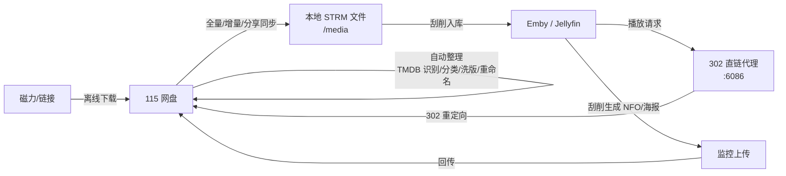

# 115-Station

115 网盘 → 本地 STRM → Emby/Jellyfin 直接播放的一站式自动化工具。

把 115 网盘的媒体库映射为本地 STRM 文件供 Emby/Jellyfin 刮削入库，播放时通过 302 直链代理让播放器直连 115（不经过服务器转发、不消耗服务器带宽），并在一个界面里完成**同步、整理、洗版、重命名、元数据回传、消息机器人**的全部闭环。


```mermaid
flowchart LR
    A[115 网盘] -- 全量/增量/分享同步 --> B[本地 STRM 文件<br>/media]
    B -- 刮削入库 --> C[Emby / Jellyfin]
    C -- 播放请求 --> D[302 直链代理<br>:6086]
    D -- 302 重定向 --> A
    C -- 刮削生成 NFO/海报 --> E[监控上传]
    E -- 回传 --> A
    F[磁力/链接] -- 离线下载 --> A
    A -- 自动整理<br>TMDB 识别/分类/洗版/重命名 --> A
```

---

## 交流群

使用问题、Bug 反馈、版本更新，都在群里聊：

**[Telegram 交流群 →](https://t.me/+7b_HYMltYMozZTk1)**

---

## 快速部署

镜像发布在 GitHub Container Registry，支持 `linux/amd64` 与 `linux/arm64`：

```
ghcr.io/pancras-loe/115-station:latest
```

新建一个目录，写入下面的 `docker-compose.yml`（仓库根目录已附带一份可直接使用）：

```yaml
services:
  station:
    image: ghcr.io/pancras-loe/115-station:latest
    container_name: 115-station
    restart: unless-stopped
    stop_grace_period: 20s    # 优雅退出窗口：SIGTERM 后程序需要 ~3 秒收尾
    ports:
      - "6060:6060"   # 管理后台
      - "6086:6086"   # 302 直链代理
    volumes:
      - ./config:/config
      - ./data:/data
      - ./media:/media
      - ./logs:/logs
    environment:
      - TZ=Asia/Shanghai
      - AUTH_USER=admin          # 管理后台账号（环境变量管理，无网页注册）
      - AUTH_PASSWORD=change-me  # ★ 改成强密码；修改后 docker compose up -d 生效
```

```bash
docker compose up -d
```

浏览器打开 `http://<服务器IP>:6060` 登录。

### 镜像 tag

| tag | 含义 |
|---|---|
| `latest` | master 最新一次构建，滚动更新 |
| `1.2.3` / `1.2` | 语义化版本，打 `v*` git tag 时产出，适合要稳定性的部署 |
| `master` | 同 `latest` |

### 自行构建（可选）

不想用预构建镜像时：

```bash
git clone https://github.com/pancras-loe/115-station.git && cd 115-station
```

```bash
docker compose up -d --build
```

compose 里把 `image:` 换成 `build: .` 即可。

---

## 亮点

- **播放不走服务器流量**：STRM 只存短链，播放时 302 到 115 CDN，播放器直连；自带 Emby 反代
- **增量同步**：基于 115 生活事件轮询，只处理网盘上的外部变更，不反复遍历目录
- **一条龙整理**：TMDB 识别（可选 AI 兜底）→ 分类 → 洗版 → 重命名 → 写 STRM → 刮削 → 刷新 Emby，全在 115 网盘内完成，可选人工确认后再入库
- **转存与资源站**：115 分享、磁力 / ed2k 离线，接入观影、PanSou、木咖、RE0 与 TG 频道，下载完自动整理
- **资源订阅**：按影片订阅，定时找缺的集，115 分享只转缺的那几集，按播出时间检查，新集播出后加密查找
- **任务中心**：所有任务排队执行，进度、历史、整理记录一处可查，识别错了改指定重新整理
- **本地海报墙**：按片目查看刮削产物与 Emby 媒体信息，勾选批量刮削
- **机器人**：企业微信 / Telegram 发链接即下载，支持搜片、搜资源、订阅、整理、同步；另有飞书、OneBot、QQ 推送
- **防风控**：115 请求全局限流（读 1s / 写 3s），批量写入合并执行

---

## 端口

| 端口 | 用途 |
|---|---|
| 6060 | 管理后台（网页） |
| 6086 | 302 直链代理（Emby 播放走这里，含 `/emby` 反代） |

> **管理员账号说明**：网页注册已移除。账号以环境变量 `AUTH_USER` / `AUTH_PASSWORD` 为准，每次启动自动同步；
> 两者都未配置且无历史账号时，首次启动会自动生成随机密码并打印在容器日志（`docker logs 115-station`）。
> 改环境变量即改密码，重启生效。容器内也可执行 `./115-station --reset-admin` 只删账号文件而保留其他配置。
>
> **二步验证与登录有效期**：「系统配置 → 登录安全」可绑定手机身份验证器（TOTP），开启后登录要再输 6 位验证码；
> 丢了验证器时加环境变量 `AUTH_OTP_RESET=true` 重启一次即可关闭。登录令牌有效期与 MoviePilot 一致，默认 8 天，
> 环境变量 `ACCESS_TOKEN_EXPIRE_MINUTES`（分钟）可改。

> **关于更新**：后台每 12 小时检查一次 GitHub 上的新版本，有新版时侧栏版本号旁出现小红点，
> 「系统配置 → 版本更新」里能看更新说明，也可以打开通知推送（同一个版本只推一次）。
> 本项目**不做**应用内一键更新（那要往容器里挂 Docker socket，风险与收益不成正比），
> 更新方式是 `docker compose pull && docker compose up -d`，配置与数据都在挂载卷里，不受影响。
> 检测走「代理配置」里的代理；不想让它联网，在「版本更新」里关掉定时检查即可。

## 基本使用流程

1. 浏览器打开 `http://IP:6060`，用 compose 里配置的 `AUTH_USER` / `AUTH_PASSWORD` 登录
2. **账号管理**：扫码或 OpenAPI 授权登录 115
3. **Strm 管理**：`STRM 配置` 填直链域名，`全量同步` 配置网盘根目录与本地 `/media` 后跑一次全量
4. 在 Emby 中手动添加媒体库并指向 `/media`，客户端通过 6086 访问 Emby，确认播放请求返回 302 后直连 CDN
5. **自动整理**：配置 TMDB / 分类 / 洗版 / 重命名规则，跑一次整理验证效果

详细说明见 **[USAGE.md 使用文档](USAGE.md)**，或打开 [`wiki/index.html`](wiki/index.html) 查看完整版 Wiki。

---

## 本地开发

需要 Go 1.25+。

```bash
go build ./... && go vet ./... && go test ./... -count=1
```

不走容器直接跑时，需要准备 `/config`、`/data`、`/media`、`/logs` 四个目录，
或用 `CONFIG_DIR` / `DATA_DIR` 环境变量指到本地路径。

项目结构与开发约定见 **[AGENTS.md](AGENTS.md)**。

---

## 注意事项

- 115 对高频请求有风控，**不要把 API 间隔调低于默认值**；写入类操作保持 ≥3s
- 公网部署请配置强 `AUTH_PASSWORD`、开启二步验证并使用 HTTPS 反代；`JWT_SECRET` 不设置会自动生成并持久化，无需手工管理
- STRM 目录（`/media`）需要 Emby 同时挂载，路径不一致时在 EMBY 配置里设置路径映射（`本地路径#Emby路径`）
- 容器停止请给足优雅退出窗口（`stop_grace_period: 20s`），否则可能留下「115 已搬移、台账未写」的中间态

## 许可证与再分发声明

本项目基于 [DaisyYijin/STRMhub](https://github.com/DaisyYijin/STRMhub) 的代码开发，该代码未附带开源许可证，
按 GitHub 服务条款与著作权法的通行规则默认为「保留所有权利」。因此本仓库**不附带 LICENSE 文件，
也不作任何开源授权声明**；ghcr 上的镜像同样适用这一状况，使用者请自行判断是否接受。

第三方组件的许可证义务独立于上述状况，所需的版权声明与许可证副本见 [`licenses/`](licenses/)
与 [THIRD-PARTY-NOTICES.md](THIRD-PARTY-NOTICES.md)。

## 免责声明

本项目仅供个人学习与技术研究使用。使用者需自行承担因使用本项目产生的一切后果，
包括但不限于账号风控、数据丢失、服务中断。请遵守 115 网盘及各资源站的用户协议与当地法律法规，
不要用于任何侵犯他人著作权的用途。

---

## 请作者喝咖啡

如果这个工具帮到了你，欢迎扫码请作者喝杯咖啡 ☕


